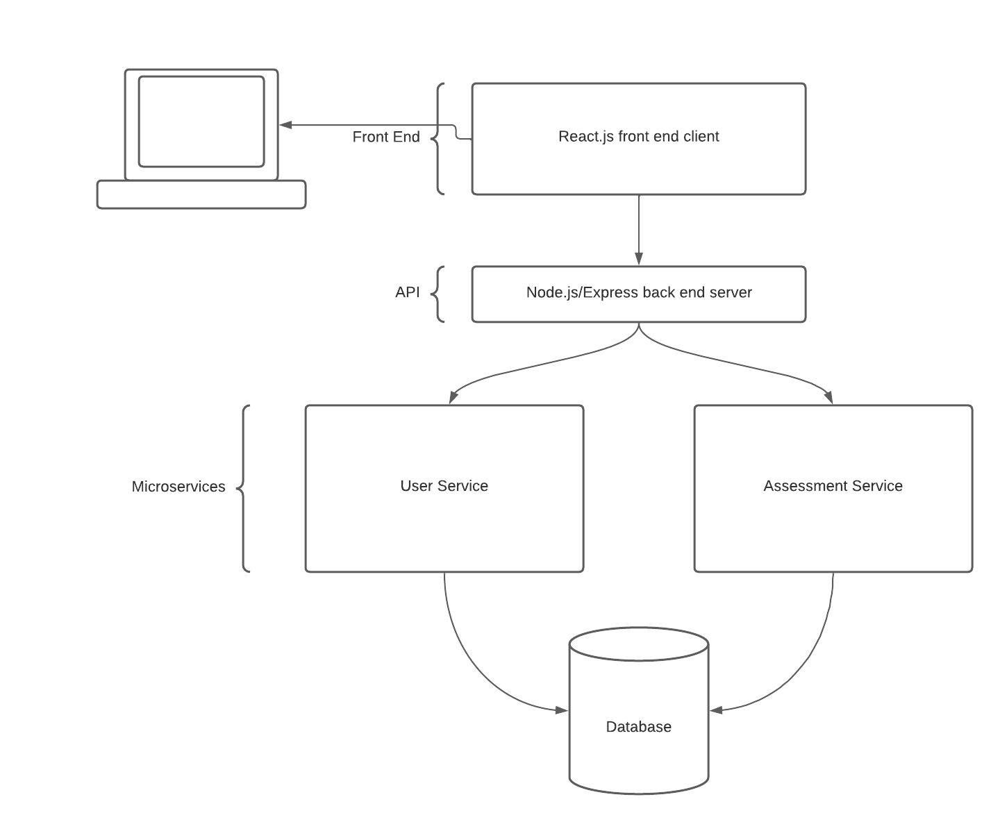

# OCAT - ITSC Internship Project

In this project, you will have the opportunity to explore the basics of web development operations as carried out at the ITSC. You will learn about some of the core technologies we use to build web application and ecosystems such as [React.js](https://reactjs.org/), [Node.js](https://nodejs.org/en/) with the [Express](http://expressjs.com/) Framework, and other libraries and tools. Below, you'll find a comprehensive list of all the technologies used in this project.

This project is a minified system of a the ORAS system, a project used by probation officers to assess the offender's likelihood of recommitting a crime (recidivism) and the factors in an offender's life that are directly related to recidivism (criminogenic needs). You'll be building a user interface to create and review assessments.

Make sure you review the [Guidelines section](#guidelines) to learn about when and how you should seek help.

Good luck!

## About Web Development

At a high-level, every web application is composed of different elements:

- **Front-end**: that's the code the runs on the user's browser. It interfaces with the user's interactions, captures their input and sends it to the application server or the backend.
  - We use React.js to build the user interface. It allows us to combine HTML, CSS, and JavaScript to build UI components and pages.
  - We use libraries and toolkits like Bootstrap and React Bootstrap to make it look nice.
- **Back-end**: This code runs on the server, it receives the user requests and inputs, processes it, stores it in a database and sends it back to the user when needed.
  - Here we use Node.js and Express to build the server. Node.js is a JavaScript runtime environment that allows us to run JavaScript code outside of the browser. Express is a web application framework for Node.js that allows us to build web applications and APIs.
- **Database**: This is where the data is stored. It's a collection of tables that store information about the users, the application, and the interactions between them.
  - We can use any type of database here like MS SQL Server, MySQL, or PostgreSQL. We use PostgreSQL because it's open-source and free.

Each one of those layers will need to communicate with the others. For example, the front-end will need to send requests to the back-end to get data from the database. The back-end will need to send requests to the database to store data. The database will need to send requests to the back-end to retrieve data. And so on.

You'll find that we need to use a number of other libraries and tools to compliment our work. For example, we will need to encrypt passwords to be able to save it securely in the database. We will need to use a version control system like Git/GitHub to keep track of our code and collaborate with others. And so on.

## Technologies

- Version Control
  - [git](https://git-scm.com/) and [Github](https://github.com/)
- Front-End Framework
  - [React.js](https://reactjs.org/)
  - Style Toolkit -> [React-Bootstrap](https://react-bootstrap.github.io/)
- Back-End Framework
  - [Express](http://expressjs.com/)
  - [Node.js](https://nodejs.org/en/)
  - Database ORM -> [Sequelize](https://sequelize.org/)
  - Password Encryption -> [Bcrypt](https://github.com/kelektiv/node.bcrypt.js)
- Database
  - [PostgreSQL](https://www.postgresql.org/)
- Package Manager (for Node.js)
  - [npm](https://www.npmjs.com/)
- Task Runners
  - [webpack](https://webpack.js.org/) through [create-react-app](https://create-react-app.dev/)

## Architecture

The application must be created with two "layers" using an API model (the "skeleton" for this has already been provided within the template repository you'll start with). Once the HTML page is rendered, all future communication between the client/server should be done using HTTP requests sending/receiving JSON.

- Client: User interface for interacting with the API (the "front-end" of the application)
- API: layer that receives requests from the front-end or a 3rd party and processes the request with the database. Allows for outside integration.
  - [Basic API explanation](https://www.freecodecamp.org/news/what-is-an-api-in-english-please-b880a3214a82/)
  - [CRUD Basics](https://www.codecademy.com/articles/what-is-crud)
- Microservices: complex layer of services that accept requests from the API and communicate with the database.
  - [Basic Microservice explanation](https://smartbear.com/solutions/microservices/)

- The below diagram resembles what you should attempt to reproduce:

# 🏁 Let's Get Started

## Tasks/Milestones

We will need to complete the following tasks to complete the project. Each task will be broken down into smaller milestones. You will be able to track your progress using the provided Project Board template.

1. [Project Setup](#a-project-setup)
2. [Setup Development Environment](#b-setup-development-environment)
3. [Build the Features](#c-features)

### A. Project Setup

1. Copy the Template Repository
NOTE: You can name this whatever you want, just make certain that you leave it "Public" so that others can view your code
    - Template:
        - [OCAT_Intern_Template](https://github.com/UC-ITSC/OCAT_Intern_Template)
    - Resources:
        - [Creating a Repository from a Template](https://docs.github.com/en/github/creating-cloning-and-archiving-repositories/creating-a-repository-from-a-template)
2. Copy the Template Project Board
    - NOTE: This is something you should keep constantly up-to-date. It is how we will track your progress, and it will facilitate code review and collaboration with your OCAT internship peers.
        - Template:
            - [OCAT Project Board](https://github.com/UC-ITSC/OCAT_Intern_Template/projects/1)
        - Resources:
            - [Copying a Project Board](https://docs.github.com/en/github/managing-your-work-on-github/copying-a-project-board)
3. Add the Provided Issues to your Project Board
    - Issues:
        - [OCAT Issues](./docs/issues.md)
    - Resources:
        - [Creating an Issue](https://docs.github.com/en/github/managing-your-work-on-github/creating-an-issue)
        - [Adding Issues to a Project Board](https://docs.github.com/en/github/managing-your-work-on-github/adding-issues-and-pull-requests-to-a-project-board#adding-issues-and-pull-requests-to-a-project-board-from-the-sidebar)

### B. Setup Development Environment

#### Navigating the OCAT File Structure

We have created some CodeTours for you to help you understand the first couple tasks.

Make sure you have installed the recommended extensions, then see the [Starting CodeTours Documentation](https://marketplace.visualstudio.com/items?itemName=vsls-contrib.codetour#starting-tours) for instructions on viewing our tours

1. Clone your new repository
    - [Cloning a Repository](https://docs.github.com/en/github/creating-cloning-and-archiving-repositories/cloning-a-repository)
2. [Install NodeJS 16.x](docs/install_nodejs.md) on your computer
3. Duplicate the `packages/api/config/default.json` file to `packages/api/config/local.json` and update the database credentials with the ones emailed to you.
   - You can also install PostgreSQL database and setup a local database instance if you prefer. See [this guide](docs/install_postgres.md) for instructions. in this case, you won't need to change the configuration.
4. Running the project
    - Navigate into the packages/client/ directory ``cd packages/client/``
    - ``npm install``
        - [npm install](https://docs.npmjs.com/cli/install#:~:text=npm%20install%20(in%20package%20directory,directory)%20as%20a%20global%20package.)
    - ``npm start``
    - Open a second terminal window and navigate into the packages/api/ directory ``cd packages/api/``
    - ``npm install``
    - ``npm start``
5. Verify that all recommended extensions are installed
    - [dbaeumer.vscode-eslint](https://marketplace.visualstudio.com/items?itemName=dbaeumer.vscode-eslint)
    - [formulahendry.auto-rename-tag](https://marketplace.visualstudio.com/items?itemName=formulahendry.auto-rename-tag)
    - [mgmcdermott.vscode-language-babel](https://marketplace.visualstudio.com/items?itemName=mgmcdermott.vscode-language-babel)
    - [visualstudioexptteam.vscodeintellicode](https://marketplace.visualstudio.com/items?itemName=VisualStudioExptTeam.vscodeintellicode)
    - [streetsidesoftware.code-spell-checker](https://marketplace.visualstudio.com/items?itemName=streetsidesoftware.code-spell-checker)
    - [gruntfuggly.todo-tree](https://marketplace.visualstudio.com/items?itemName=Gruntfuggly.todo-tree)
    - [vsls-contrib.codetour](https://marketplace.visualstudio.com/items?itemName=vsls-contrib.codetour)
    - [herrmannplatz.npm-dependency-links](https://marketplace.visualstudio.com/items?itemName=herrmannplatz.npm-dependency-links)
    - [christian-kohler.path-intellisense](https://marketplace.visualstudio.com/items?itemName=christian-kohler.path-intellisense)
6. Start the "Task 1" CodeTour
    - [Starting Tours](https://marketplace.visualstudio.com/items?itemName=vsls-contrib.codetour#starting-tours)
7. Happy Coding!

### C. Features

- NOTE: These are the general requirements for features 1, 2 and 3. For specific instructions, see the code tours.
- NOTE: Please do any login-related pieces near the end. Otherwise, you may spend the entire time developing a login process and you will not have much to show come presentation time.
- NOTE: All work should be done on a separate "branch" so that it can be code reviewed. Below are instructions on how to create a new branch:
  - [Creating a branch](https://docs.github.com/en/desktop/contributing-and-collaborating-using-github-desktop/managing-branches#creating-a-branch)

1. Allow Users to submit an assessment with the following information
    - NOTE: An "assessment" has a type, five questions, and two responses per question ->
    - Use the example info here: [OCAT Assessment Info](./docs/assessment_info.md)
        - Instrument Name (static text field)
          - this is the type of assessment that is currently being conducted -> Example: Cat Behavioral Instrument
        - Cat Name (text) -> Example: Mr. Fluffykins
        - Cat Date of Birth (date)
        - Score (integer calculated by the sum of all responses)
        - Risk Level (text - low [0-1], medium [2-3], high [4-5] determined by the calculated score)
        - Audit log of when the assessment was created/deleted (datetime with timezone)
    - Recommend using [React Hook Form](https://react-hook-form.com/)
2. Implement a bootstrap style template to make your site look presentable
    - NOTE: Do not spend too much time on this. We want the application to look good but not at the risk of hindering the overall completion of your project
3. Allow Users and Supervisors to sort/search/filter/review submitted assessments from a list
    - Should only return non-deleted assessments
    - The list should include (at minimum) cat name, cat date of birth, instrument, score, risk level, and creation date
    - Recommend using [React Table](https://www.npmjs.com/package/react-table)
4. Allow Supervisors to log into the system
    - This must authenticate against the database using [Bcrypt](https://www.npmjs.com/package/bcrypt)
5. Allow Supervisors to delete assessment submissions
    - This should be a soft delete in the database (a soft delete does not remove the data from the database, it sets a flag on the record so it does not show up on the front-end)
    - Soft deletes are built into Sequelize
6. Prepare your presentation!

## Guidelines

- Setup
  - PLEASE ask if you're having trouble setting up your project repository, project board, first branch, or development environment. The mentors are here to help you! We want to make sure you get off to a great start and this part is often the most challenging, so please don't hesitate to come to us immediately with any setup concerns!
- Hour/Day Policy
  - If you've been stuck on something for two hours, ask a fellow intern!
  - If you've been stuck on something for a full day, ask a mentor!
- Process for Getting Unstuck
    1. Search through the available resources in this document (located at the bottom of the page and throughout)
    2. Google! This is your most valuable resource and learning how to search the internet for your answer is going to be your most valuable skill moving forward! Forum resources like StackOverflow can be extremely helpful. In web development, there's almost always someone who has encountered your problem before. The trick lies in finding that answer!
    3. Ask an OCAT internship peer
       1. We encourage that you help each other, but please do not just copy each other's code. This is a collaborative process, and asking questions when you're confused is an important part of learning! On the flip-side of that, teaching someone else or helping them through a problem is the best way to further cement that knowledge in your own mind. So ask questions when you're stuck and help point your fellow teammates in the right direction!
    4. Ask an OCAT mentor
- [Code Review](./docs/code_review.md) Guidelines
  - Please follow the code review guidelines when submitting your code for review. This will help ensure that your code is reviewed in a timely manner and that you get the most out of your code review experience.

## Resources

- **React**
  - [Intro to React](https://reactjs.org/tutorial/tutorial.html)
  - [Main Concepts](https://reactjs.org/docs/hello-world.html)
  - Video: [React Tutorial for Beginners](https://www.youtube.com/watch?v=dGcsHMXbSOA)

- **React Routing**
  - [React Router](https://www.reactrouter.com)
  - [react-router-dom's npm page](https://www.npmjs.com/package/react-router-dom)
  - Video: [React Router Tutorial](https://www.youtube.com/watch?v=Law7wfdg_ls)

- **Bootstrap**
  - [Bootstrap Documentation](https://getbootstrap.com/docs/5.0/getting-started/introduction/)
  - [Bootstrap Templates](https://github.com/therebelrobot/awesome-bootstrap#templates)
  - Video: [Make a React Website with Bootstrap - Beginners](https://www.youtube.com/watch?v=RcfvUWJqHOs)

- ****Express****
  - [Express API Reference](http://expressjs.com/en/4x/api.html)
  - Video: [Learn Express & Node.js in 15 Minutes](https://www.youtube.com/watch?v=JlgKybraoy4)

- **Sequelize (ORM)**
  - [API Reference](https://sequelize.org/api/v6/identifiers)
  - [What is Sequelize?](https://www.educative.io/answers/what-is-sequelizejs)
  - [Using Sequelize with TypeScript](https://sequelize.org/docs/v6/other-topics/typescript/)
  - [Sequelize Example and Model Builder](https://sequelizeui.app/schema/employees)
  - [Sequelize's npm page](https://www.npmjs.com/package/sequelize)
  - Video: [Sequelize Tutorial - Getting Started with Sequelize and PostgreSQL](https://www.youtube.com/watch?v=p-yKR7GusqM)

- **React.js HTTP Requests with Axios**
  - [Using Axios with React](https://www.digitalocean.com/community/tutorials/react-axios-react)
  - [Axios' npm page](https://www.npmjs.com/package/axios)
  - Video: [How to use Axios with React](https://www.youtube.com/watch?v=oQnojIyTXb8)

- **React Hook Form**
  - [Main Page](https://react-hook-form.com/)
  - [Examples](https://github.com/react-hook-form/react-hook-form/tree/master/examples)
  - [react-hook-form's npm page](https://www.npmjs.com/package/react-hook-form)
  - Video: [React Hook Form Tutorial](https://www.youtube.com/watch?v=bU_eq8qyjic)

- **React Table**
  - [Main Page](https://react-table.tanstack.com/)
  - [How to Use React Table](https://codehandbook.org/how-to-use-react-table-in-react-web-app/)
  - [react-table's npm page](https://www.npmjs.com/package/react-table)

- **Bcrypt**
  - [Hashing Passwords with Node.js and Bcrypt](https://www.abeautifulsite.net/hashing-passwords-with-nodejs-and-bcrypt)
  - [User Authentication using Bcrypt](https://medium.com/@holtkam2/add-user-authentication-to-your-node-expressjs-application-using-bcrypt-81bb0f618ab3)
  - [bcrypt npm page](https://www.npmjs.com/package/bcrypt)

- **PostgreSQL**
  - [Documentation](https://www.postgresql.org/)
  - Access the Database
    - Windows developers should use -> [pgAdmin](https://www.pgadmin.org/download/)
    - Mac developers should use -> [postico](https://eggerapps.at/postico/)

## Advanced Resources

- Design principles
  - SOLID: [The First Five Principles of Object Oriented Design](https://scotch.io/bar-talk/s-o-l-i-d-the-first-five-principles-of-object-oriented-design)
  - DRY: [Don't Repeat Yourself](https://medium.com/better-programming/keeping-your-code-dry-1105377c9c80)
  - KISS: [Keep it Short and Simple](https://www.interaction-design.org/literature/article/kiss-keep-it-simple-stupid-a-design-principle)

- Functional Programming in Javascript
  - [Playlist from Fun Fun Function](https://www.youtube.com/watch?v=BMUiFMZr7vk&list=PL0zVEGEvSaeEd9hlmCXrk5yUyqUag-n84)
  - Useful MDN Links
    - [.map](https://developer.mozilla.org/en-US/docs/Web/JavaScript/Reference/Global_Objects/Array/map)
    - [.filter](https://developer.mozilla.org/en-US/docs/Web/JavaScript/Reference/Global_Objects/Array/filter)
    - [.find](https://developer.mozilla.org/en-US/docs/Web/JavaScript/Reference/Global_Objects/Array/find)
