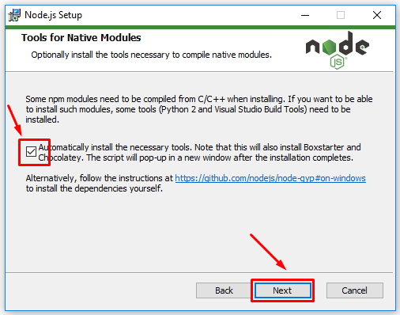

# Install NodeJS 16.x on your computer

NOTE: if the install link for your platform doesn't work, visit the [Latest 16.x for all platforms](https://nodejs.org/download/release/latest-v16.x/) link

* [MacOS Installer for 16.19.0](https://nodejs.org/download/release/latest-v16.x/node-v16.19.0.pkg)
* Windows When installing windows, please make sure to check the "Automatically install the necessary tools" box at the end
     
  * [Windows x64 Installer for 16.19.0](https://nodejs.org/download/release/latest-v16.x/node-v16.19.0-x64.msi)
  * [Windows x86 Installer for 16.19.0](https://nodejs.org/download/release/latest-v16.x/node-v16.19.0-x86.msi)
* [Latest 16.x for all platforms](https://nodejs.org/download/release/latest-v16.x/)
